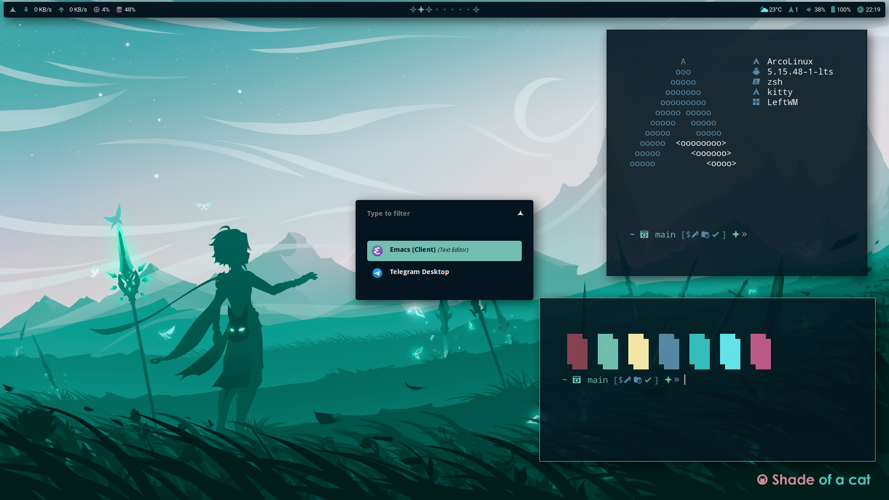

# XIAO

## Packages

```
DE          : Arch
WM          : Leftwm
terminal    : Kitty
bar         : Polybar
launcher    : Rofi
```

## Screenshot



## Dependencies

- [leftwm-git](https://github.com/leftwm/leftwm)
- [picom](https://github.com/ibhagwan/picom)
- [polybar](https://github.com/polybar/polybar)
- [rofi](https://github.com/davatorium/rofi)

## Installation

1. Install all required dependencies

2. Clone the repository

```BASH
git clone https://github.com/ghaerdi/xiao.git
```

3. Make a copy of this project in your themes folder

```BASH
cp -r ./xiao ~/.config/leftwm/themes
```

4. Remove the symlink to your current theme if set

```BASH
rm ~/.config/leftwm/themes/current
```
5. Set this as your current theme

```BASH
ln -s ~/.config/leftwm/themes/xiao ~/.config/leftwm/themes/current
```

6. Restart your window manager

```Default shortcut
$MOD + Shift + r
```
